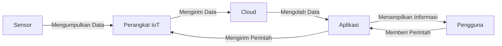

## Apa itu Internet of Things?

Internet of Things, atau IoT, adalah konsep di mana benda-benda di sekitar kita terhubung ke internet dan bisa berkomunikasi satu sama lain. Bayangkan jika kulkas Anda bisa memberi tahu ketika susu habis, atau lampu rumah yang bisa Anda nyalakan dari ponsel Anda!

<Image src="/images/blogs/iot.jpeg" width="718" height="404" alt="Internet of Things" />

## Komponen Utama IoT

1. **Perangkat**: Benda-benda fisik yang dilengkapi sensor dan konektivitas.
2. **Sensor**: Mengumpulkan data dari lingkungan sekitar.
3. **Konektivitas**: Mengirim data ke cloud melalui berbagai protokol.
4. **Cloud**: Tempat penyimpanan dan pengolahan data.
5. **Antarmuka Pengguna**: Aplikasi atau dashboard untuk mengontrol dan memantau perangkat.

## Contoh Penerapan IoT dalam Kehidupan Sehari-hari

1. **Rumah Pintar**: Kontrol lampu, AC, dan keamanan rumah dari smartphone.
2. **Kesehatan**: Pemantauan detak jantung dan aktivitas fisik melalui smartwatch.
3. **Pertanian**: Sensor kelembaban tanah untuk irigasi otomatis.
4. **Transportasi**: Pelacakan lokasi dan kondisi kendaraan secara real-time.

## Cara Kerja IoT Sederhana



## Keuntungan dan Tantangan IoT

### Keuntungan:

- Efisiensi dan otomatisasi
- Pemantauan jarak jauh
- Pengambilan keputusan berbasis data

### Tantangan:

- Keamanan dan privasi data
- Interoperabilitas antar perangkat
- Konsumsi energi

## Memulai dengan IoT

Jika Anda tertarik untuk belajar lebih lanjut tentang IoT, berikut beberapa langkah yang bisa Anda ambil:

1. **Pelajari Dasar-dasar Elektronika**: Pahami konsep dasar sirkuit, resistor, dan kapasitor.
2. **Kenali Mikrokontroler**: Mulai dengan Arduino atau Raspberry Pi untuk proyek sederhana.
3. **Belajar Pemrograman**: Python dan C++ adalah bahasa populer dalam IoT.
4. **Eksplorasi Protokol Komunikasi**: Pelajari MQTT, HTTP, dan CoAP.
5. **Coba Proyek Sederhana**: Buat proyek seperti pemantau suhu ruangan atau sistem penyiraman tanaman otomatis.

## Kode Contoh: Membaca Suhu dengan Arduino

Berikut adalah contoh sederhana kode Arduino untuk membaca suhu menggunakan sensor DHT11:

```cpp
#include <DHT.h>

#define DHTPIN 2     // Pin dimana sensor DHT terhubung
#define DHTTYPE DHT11   // Tipe sensor DHT 11

DHT dht(DHTPIN, DHTTYPE);

void setup() {
  Serial.begin(9600);
  dht.begin();
}

void loop() {
  delay(2000);  // Tunggu 2 detik antara pengukuran

  float t = dht.readTemperature();  // Baca suhu

  if (isnan(t)) {
    Serial.println("Gagal membaca dari sensor DHT!");
    return;
  }

  Serial.print("Suhu: ");
  Serial.print(t);
  Serial.println(" *C");
}
```

Kode ini akan membaca suhu dari sensor DHT11 setiap 2 detik dan menampilkannya di Serial Monitor.

## Kesimpulan

Internet of Things membuka banyak kemungkinan untuk membuat hidup kita lebih mudah dan efisien. Dengan memahami dasar-dasar IoT, Anda bisa mulai mengeksplorasi dan bahkan menciptakan solusi inovatif untuk masalah sehari-hari!

## Sumber Belajar Lebih Lanjut

1. [Coursera - Introduction to the Internet of Things and Embedded Systems](https://www.coursera.org/learn/iot)
2. [edX - Introduction to the Internet of Things (IoT)](https://www.edx.org/learn/internet-of-things/curtin-university-internet-of-things-iot)
3. [Arduino Official Website](https://www.arduino.cc/en/Tutorial/HomePage)

Selamat belajar dan bereksperimen dengan Internet of Things!
